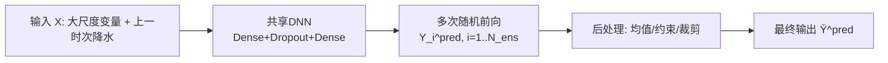
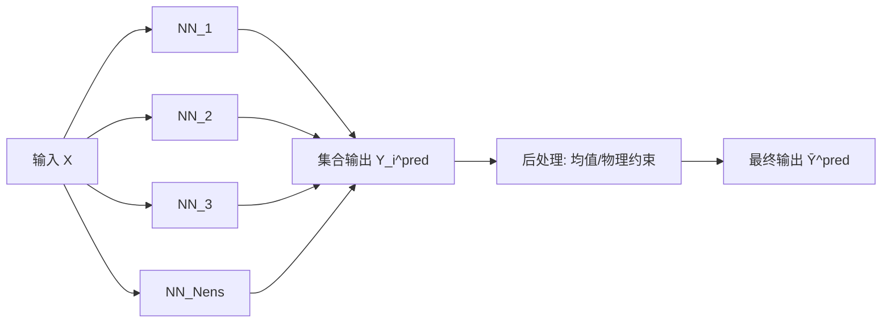

# 三种神经网络参数化框架（代码图）

下面基于你给的图，给出 3 种框架的“代码图（Mermaid）+ Keras 代码骨架”。

---

## 1) 单个 DNN + Dropout（MC Dropout / 随机参数化）



```python
import tensorflow as tf
from tensorflow.keras import layers, Model

def build_mc_dropout_dnn(n_in, n_out, hidden=256, dropout=0.2):
    inp = layers.Input(shape=(n_in,))
    x = layers.Dense(hidden, activation="relu")(inp)
    x = layers.Dropout(dropout)(x)       # 训练和推理都可启用(采样)
    x = layers.Dense(hidden, activation="relu")(x)
    x = layers.Dropout(dropout)(x)
    out = layers.Dense(n_out, activation="linear")(x)
    return Model(inp, out, name="mc_dropout_dnn")

@tf.function
def ensemble_predict_mc(model, x, n_ens=20):
    ys = [model(x, training=True) for _ in range(n_ens)]   # MC采样
    y_stack = tf.stack(ys, axis=0)                         # (n_ens,batch,n_out)
    y_mean = tf.reduce_mean(y_stack, axis=0)
    return y_stack, y_mean
```

---

## 2) 多网络集成（Deep Ensemble）



```python
def build_base_nn(n_in, n_out, hidden=256):
    inp = layers.Input(shape=(n_in,))
    x = layers.Dense(hidden, activation="relu")(inp)
    x = layers.Dense(hidden, activation="relu")(x)
    out = layers.Dense(n_out, activation="linear")(x)
    return Model(inp, out, name="base_nn")

def build_deep_ensemble(n_ens, n_in, n_out):
    models = []
    for i in range(n_ens):
        m = build_base_nn(n_in, n_out)
        m._name = f"ensemble_nn_{i+1}"
        models.append(m)
    return models

def ensemble_predict(models, x):
    ys = [m(x, training=False) for m in models]
    y_stack = tf.stack(ys, axis=0)
    y_mean = tf.reduce_mean(y_stack, axis=0)
    return y_stack, y_mean
```

---

## 3) 编码器-解码器 + 潜变量扰动（VAE风格随机参数化）

```mermaid
flowchart LR
    X[输入 X] --> ENC[Encoder]
    ENC --> MU[μ]
    ENC --> LOGV[logσ²]
    MU --> Z[z = μ + σ*ε]
    LOGV --> Z
    EPS[ε~N(0,1)<br/>可加额外扰动] --> Z
    Z --> DEC[Decoder]
    DEC --> YS[样本输出 Y_i^pred]
    YS --> POST[后处理: 均值/约束]
    POST --> YBAR[最终输出 Ȳ^pred]
```

```python
def build_stochastic_encoder_decoder(n_in, z_dim, n_out, hidden=256):
    # encoder
    inp = layers.Input(shape=(n_in,))
    h = layers.Dense(hidden, activation="relu")(inp)
    h = layers.Dense(hidden, activation="relu")(h)
    mu = layers.Dense(z_dim, name="z_mean")(h)
    logvar = layers.Dense(z_dim, name="z_logvar")(h)

    # reparameterization
    def sample(args):
        m, lv = args
        eps = tf.random.normal(tf.shape(m))
        return m + tf.exp(0.5 * lv) * eps

    z = layers.Lambda(sample, name="z_sample")([mu, logvar])

    # decoder
    d = layers.Dense(hidden, activation="relu")(z)
    d = layers.Dense(hidden, activation="relu")(d)
    out = layers.Dense(n_out, activation="linear")(d)
    model = Model(inp, [out, mu, logvar], name="stochastic_enc_dec")
    return model
```

---

## 在线耦合后处理（3种框架通用）

```python
def postprocess_for_online_coupling(y, clip_min=None, clip_max=None):
    # 示例：物理裁剪 + 缩放 + 单位转换（按需扩展）
    if clip_min is not None or clip_max is not None:
        y = tf.clip_by_value(
            y,
            clip_value_min=clip_min if clip_min is not None else -1e30,
            clip_value_max=clip_max if clip_max is not None else 1e30,
        )
    return y
```

